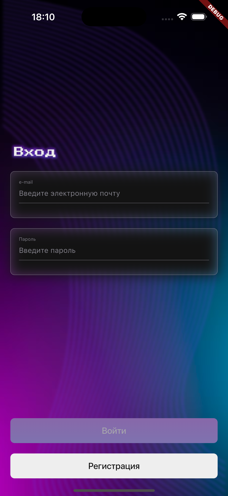
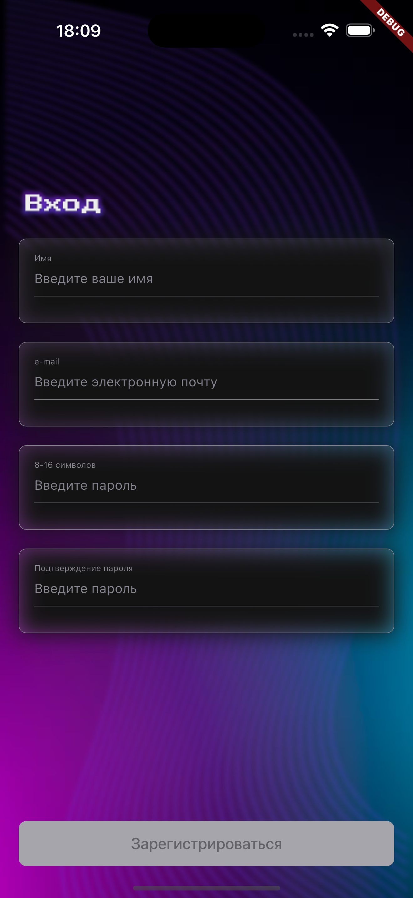
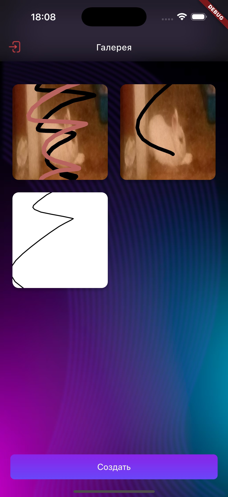
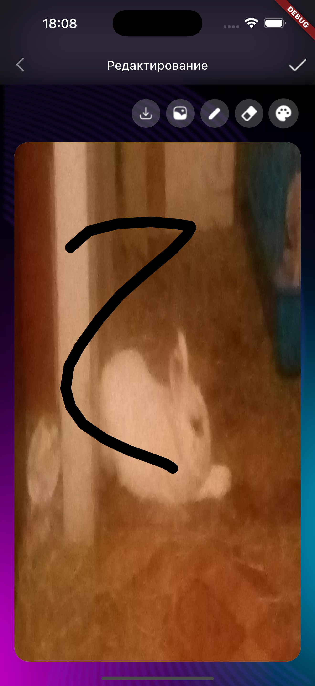
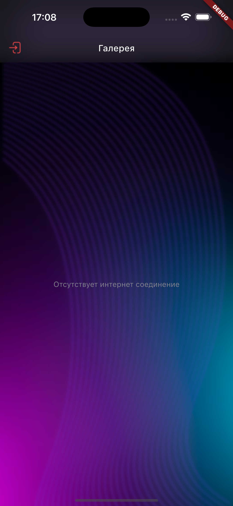
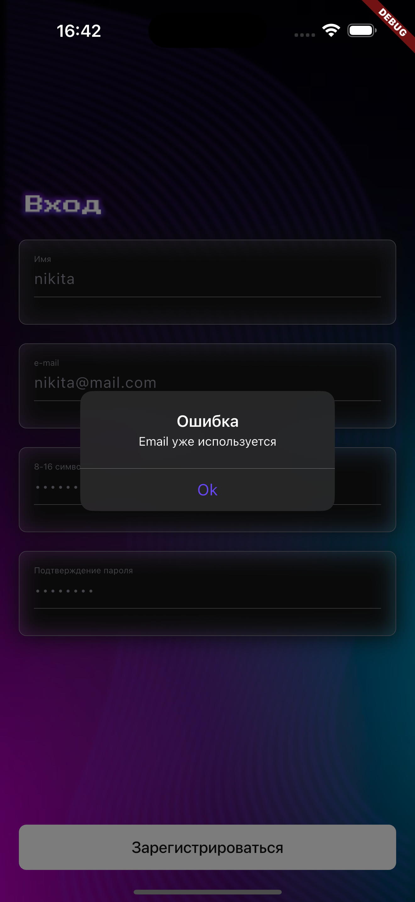
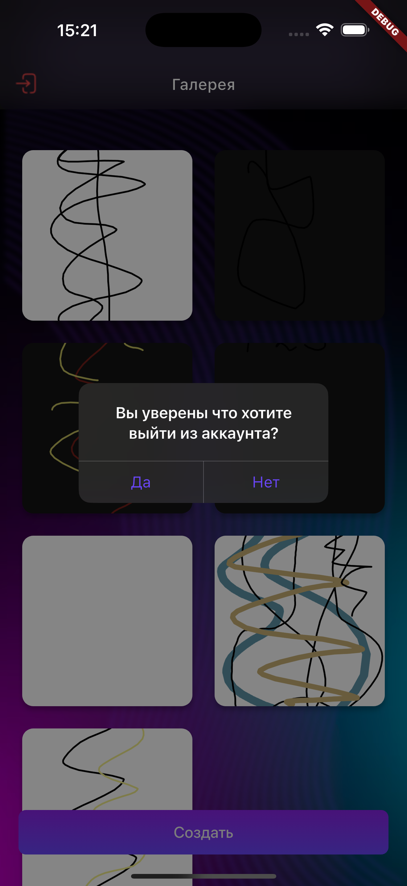
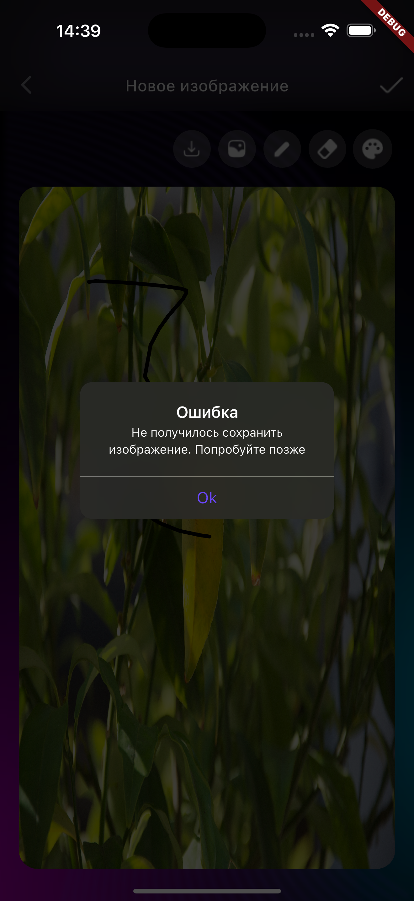
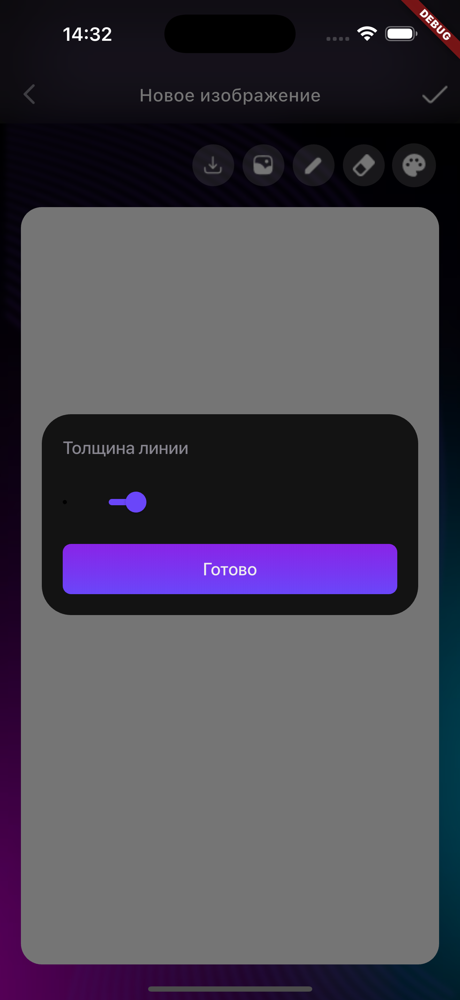

# Draw vault

Тестовое задание

## Используемые технологии
- Flutter
- Dart
- Bloc
- FirebaseAuth, FirebaseCore, FirebaseFirestore
- get_it+injectable для di
- auto_route - для навигации
- flutter_local_notifications для локальных уведомлений
- share_plus, image_pickers

## Описание архитектуры

Проект поделен на фичи и базовую папку с общими сущностями и базовыми сервисами(навигация, пуши, проверка интернет соединения). Каждая фича разделена на 3 слоя(domain, data, presentation).
- domain - самый независимый слой(там располагаются сущности бизнес логики и интерфейсы репозиториев)
- data - слой доступа к данным
- presentation - слой ui(виджеты и блок)

Общие сущности вынесены в core/, они используются во всем проекте

Общение между блоком и репозиторием происхоsдит через интерфейс между ними. Это гарантирует, что бизнес логика будет независима от того как реализован каждый конкретный репозиторий.s

Инъекция зависимостей происходит через конструктор. Для di используется get_it+injectable. Нужные сущности помечаются аннотациями.

## Описание функционала

- Авторизация и регистрация через firebase с обрабокой ошибок и кастомными сообщениями для ошибок
- Список изображений
- Экран редактирования и создания картинки(включает в себя канвас, локальное сохранение изображения, выбор толщины карандаша, выбор цвета карандаша)

## P.S.
Сохранение изображений происходит через firestore как base64 строка, разбитая на части, потому что тз включало в себя обязательное хранение картинок в firebase, но firebase storage платный :s(

## Скрины

    
    
    
    
    
    
    
    
    

